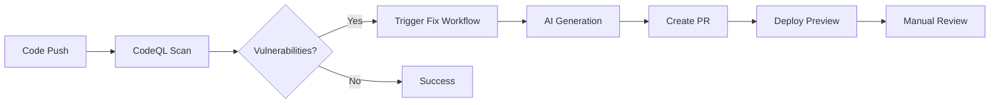

# Security Automation Documentation

## Overview

This repository implements a comprehensive automated security vulnerability detection and remediation system using GitHub Actions, CodeQL, and AI-powered code generation.

## 🚀 Features

### 1. **Automated Security Scanning**
- **CodeQL Analysis**: Continuous scanning for security vulnerabilities
- **Dependency Scanning**: Detection of vulnerable dependencies
- **Scheduled Scans**: Daily security checks
- **PR Validation**: Security checks on all pull requests

### 2. **AI-Powered Fix Generation**
- **GitHub Models API**: GPT-4o integration for intelligent fixes
- **Context-Aware**: Analyzes surrounding code for proper fixes
- **Format Preservation**: Maintains code style and indentation
- **Debug Transparency**: Raw AI responses included in PRs

### 3. **Automated PR Creation**
- **GitHub App Integration**: Enables full workflow triggers
- **Preview Deployments**: Azure Static Web Apps for testing
- **Fallback Mechanisms**: Issues created when PRs blocked
- **Rich Documentation**: Detailed fix descriptions in PRs

## 🛠️ Setup Guide

### Prerequisites

1. **GitHub Repository Settings**
   - Go to Settings → Actions → General
   - Set "Workflow permissions" to **Read and write permissions**
   - Enable "Allow GitHub Actions to create and approve pull requests"

2. **Create GitHub App**
   ```
   1. Go to https://github.com/settings/apps
   2. Click "New GitHub App"
   3. Configure with these permissions:
      - Contents: Write
      - Pull requests: Write
      - Issues: Write
      - Actions: Read
      - Metadata: Read
   4. Generate private key
   5. Install on your repository
   ```

3. **Add Repository Secrets**
   ```
   Settings → Secrets and variables → Actions
   
   Required secrets:
   - APP_ID: Your GitHub App ID (numeric)
   - PRIVATE_KEY: Complete .pem file contents
   ```

### Workflow Files

#### 1. **CodeQL Security Analysis** (`.github/workflows/codeql.yml`)
   - Runs on push, PR, and schedule
   - Configurable scan levels
   - JavaScript/TypeScript analysis

#### 2. **Auto-Fix Security Vulnerabilities** (`.github/workflows/auto-security-fix.yml`)
   - Triggered by CodeQL completion
   - AI-powered fix generation
   - Automated PR creation

## 📊 Production Recommendations

### For Enterprise Use

#### 1. **GitHub Copilot Enterprise** ($39/user/month)
```yaml
Benefits:
  - Rate Limits: 1000+ requests/day (vs 50 free)
  - Priority Access: Faster response times
  - SLA Guarantees: 99.9% uptime
  - Support: Priority support channel
```

#### 2. **Rate Limit Management**
```javascript
// Implement queue system for API calls
const rateLimiter = {
  maxRequests: 1000,  // Enterprise limit
  timeWindow: 86400,  // 24 hours
  queue: [],
  retryAfter: 3600    // 1 hour backoff
};
```

#### 3. **Monitoring Setup**
```yaml
Metrics to Track:
  - AI fix success rate (target: >90%)
  - Syntax error rate (target: <5%)
  - Rate limit utilization
  - Time to remediation
  - PR merge rate
```

#### 4. **Security Best Practices**
- **Key Rotation**: Quarterly GitHub App private key rotation
- **Permission Audit**: Monthly review of app permissions
- **Token Monitoring**: Track token usage in audit logs
- **Backup Strategy**: Alternative AI services configured

## 🔍 How It Works

### Vulnerability Detection Flow


### AI Fix Generation Pipeline (v2.0 - Full File Context)
```bash
1. Read ENTIRE source file for complete context
2. Generate comprehensive prompt with full file
3. Call GitHub Models API (GPT-4o)
4. Process response:
   - Decode JSON escapes (jq -r)
   - Remove security comments
   - Preserve complete file structure
5. Replace entire file with AI response
6. Validate syntax (tsc/node -c)
7. Include debug info in PR
```

**Key Improvement**: AI now receives and returns complete files instead of line ranges,
preventing syntax errors and structural breaks.

### PR Creation Strategy
```yaml
Primary Method:
  - GitHub App token for full triggers
  - Enables preview deployments
  
Fallback Chain:
  1. GitHub CLI (gh pr create)
  2. REST API direct call
  3. Issue creation with instructions
```

## 📈 Rate Limits and Quotas

### Free Tier Limits
| Service | Limit | Reset Period | Cost |
|---------|-------|--------------|------|
| GitHub Models API | 50 requests | 24 hours | Free |
| GitHub Actions | 2,000 minutes/month | Monthly | Free |
| CodeQL | Unlimited | - | Free |

### Enterprise Limits
| Service | Limit | Reset Period | Cost |
|---------|-------|--------------|------|
| GitHub Models API | 1,000+ requests | 24 hours | $39/user/month |
| GitHub Actions | 50,000 minutes/month | Monthly | Included |
| CodeQL | Unlimited | - | Included |

### Checking Usage
```bash
# Check GitHub Models usage
gh api rate_limit | jq '.resources.models'

# Check Actions minutes
gh api repos/{owner}/{repo}/actions/runners | jq '.total_count'

# Check when rate limit resets
date -d "@$(gh api rate_limit | jq '.resources.models.reset')"
```

## 🐛 Troubleshooting

### Common Issues

#### 1. **Rate Limit Exceeded**
```
Error: Rate limit of 50 per 86400s exceeded
Solution: Wait for reset or upgrade to Enterprise
```

#### 2. **PR Creation Failed**
```
Error: GitHub Actions is not permitted to create pull requests
Solution: Enable in Settings → Actions → Workflow permissions
```

#### 3. **GitHub App Token Failed**
```
Error: Not Found - installation
Solution: Verify app is installed on repository
```

#### 4. **AI Generated Invalid Code**
```
Error: TypeScript syntax error, missing braces, broken functions
Solution: Workflow now uses full file context (v2.0)
Previous issues fixed by sending complete files to AI
```

#### 5. **Recursive Workflow Loops**
```
Error: Security fix PRs trigger more security fixes
Solution: Workflow skips security-fix/* branches
Prevents infinite PR creation loops
```

### Debug Commands
```bash
# Test GitHub App installation
gh api /repos/{owner}/{repo}/installation

# Check workflow permissions
gh api repos/{owner}/{repo}/actions/permissions/workflow

# View recent workflow runs
gh run list --workflow="Auto-Fix Security Vulnerabilities"

# Check PR status
gh pr view {number} --json statusCheckRollup
```

## 📝 Configuration

### Customizing AI Prompts
Edit `.github/workflows/auto-security-fix.yml`:
```yaml
CRITICAL RESPONSE FORMAT REQUIREMENTS:
1. Return COMPLETE code block
2. Include ALL lines
3. NO markdown formatting
4. Preserve exact indentation
```

### Adjusting Security Rules
Edit `.github/workflows/codeql.yml`:
```yaml
queries:
  - uses: security-extended  # Comprehensive
  - uses: security-and-quality  # Balanced
```

### Modifying Scan Schedule
```yaml
schedule:
  - cron: '30 2 * * *'  # Daily at 2:30 UTC
```

## 🔒 Security Considerations

### Data Privacy
- AI prompts contain code context (±5 lines)
- No sensitive data should be in code
- Responses logged in PR for transparency

### Access Control
- GitHub App uses minimal permissions
- Tokens expire after 1 hour
- Private keys stored as secrets

### Audit Trail
- All AI fixes tracked in PRs
- Workflow logs retained 90 days
- GitHub App activity logged

## 📚 References

### Documentation
- [GitHub CodeQL](https://codeql.github.com/)
- [GitHub Models API](https://github.com/marketplace/models)
- [GitHub Apps](https://docs.github.com/en/apps)
- [Azure Static Web Apps](https://azure.microsoft.com/en-us/services/app-service/static/)

### Related Documentation
- [SECURITY-AUTOMATION-SUMMARY.md](./SECURITY-AUTOMATION-SUMMARY.md) - Initial implementation details and testing
- [ADR.md](./ADR.md) - Architecture Decision Records:
  - ADR-001: CodeQL Security Scanning
  - ADR-002: Multi-Tier PR Fallback
  - ADR-003: GitHub App Integration
  - ADR-004: AI-Powered Fix Generation
- [TODO.md](./TODO.md) - Project task tracking

## 📞 Support

### For Issues
1. Check troubleshooting guide above
2. Review workflow logs
3. Create issue with debug information

### For Enhancements
1. Review existing ADRs
2. Propose changes via PR
3. Update documentation

## 📄 License

This security automation system is part of the repository and follows the same license terms.

---

*Last Updated: 2025-09-02*
*Version: 1.0.0*